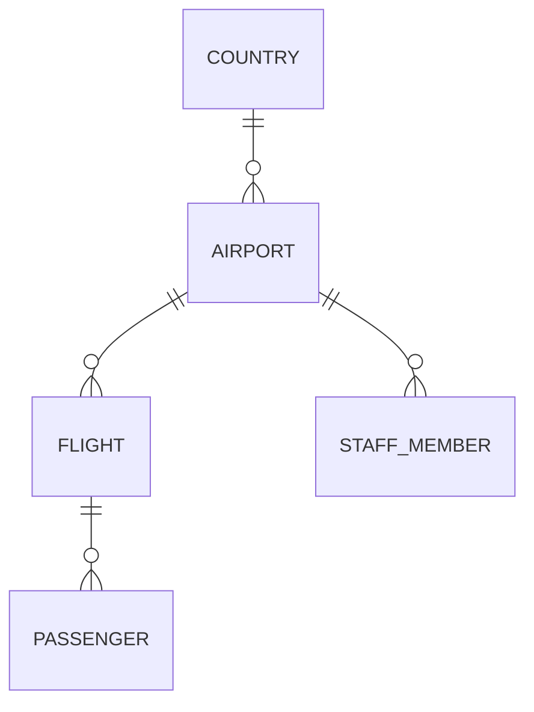

Sometimes a user may choose to use the file transformation stage to `normalise` a heavily nested dataset into separate entities during the initial reading of data. This would be done by specifying different entities in the dataset section of the contract configuration in the `dischema` file. This allows for easier interaction when customising errors in the data contract or writing transformations in the business rules.

`Normalising` assets can lead to more complex validations being required. For example in the dataset:

### Missing Parent Records

It could be that an airport record is deemed invalid and removed. Due to this, any flight records that linked to the now removed airport record are themselves invalid - a situation we refer to as a `missing_parent` issue, but are now existing in an entirely different entity.

### No Valid Mandatory Records

It could also be the case that staff records are a mandatory field for airport records. If all staff records for a particular airport record are removed during validation, this itself would invalidate the airport record - a situation we refer to as `no_valid_records` issue - but again the invalid airport record is in a different entity.

### Dischema

In order to perform these validations, how to link normalised entities needs to be provided. This can be specified in the `entity_relationships` section of the `dischema`.

## Entity Relationships Content

To allow the DVE to link between normalised assets, the following information should be provided (per linkable entity):

- parent_entity: the immediate parent of the entity
- join_fields: how to join the entity with its parent in dictionary form (parent_field_name: child_field_name)
- mandatory: whether the child entity is a mandatory field in the immediate parent

There is also the functionality to customise errors related to either missing parent or group rejections:

- missing_parent_id_error_code: the error code to display if a record is rejected as it has no valid parent record
- missing_parent_id_error_message: the error message to display if a record is rejected as it hs no valid parent record
- no_valid_records_error_code: the error code to display if parent records are removed due to no valid children in a mandatory field
- no_valid_records_error_message: the error message to display if parent records are removed due to no valid children in a mandatory field

!!! note
    For root entities, you don't need to specify entity relationships - this will be inferred based on their absence.
    But you may wish to so that error codes and messages can be customised. Ensure that for root entities the parent_entity
    abd join_fields values are left blank.

## Entity Hierarchy Object

The details provided in the entity_relationships section of the dischema are used to create an EntityHierarchy object.
Please refer to [Advanced User Guidance: Entity Hierarchy](../advanced_guidance/package_documentation/entity_hierarchy.md).
