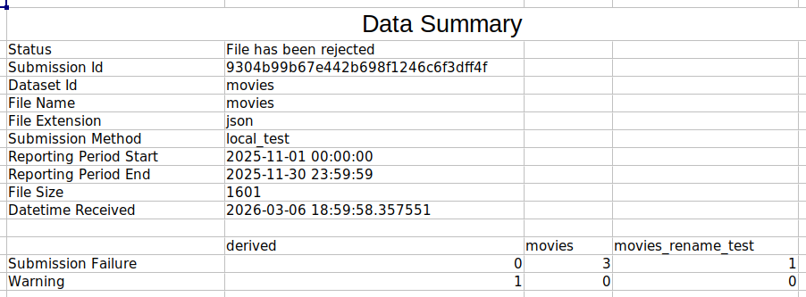
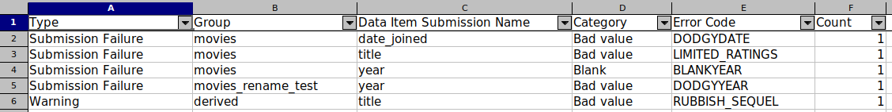
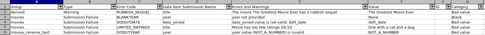

As mentioned in the [Introduction](../index.md) a fourth optional component is offered with the DVE. This is known as the Error Reports. This step will collate the [Feedback Messages](./feedback_messages.md) and populate them into an spreadsheet document.

The Error Report will be available for each submission under `error_report/` folder.

## Summary
Contains metadata around the submission and whether it was successful.

## Error Summary
Contains an aggregation of all the errors and warnings that have occured and how many times they occured for that submission.

## Error Data
Provides a breakdown of every single error that occured within a submission.

!!! note

    The images above were generated from our movies test dataset. You can view the rules and data [here](https://github.com/NHSDigital/data-validation-engine/tree/main/tests/testdata/movies).
